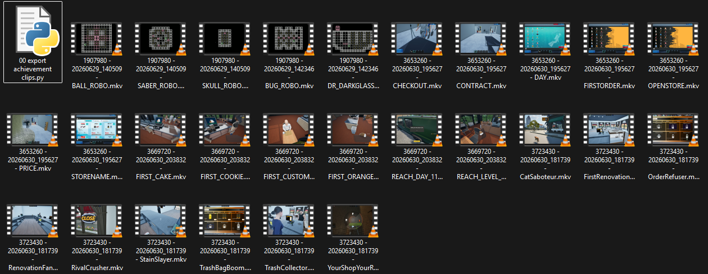

# Achievement-Clip-Exporter
## Python script to export clips in steam game recordings of achievements earned

First install Python from https://www.python.org/downloads/
During install make sure you tick “Add Python to PATH”

Next install FFmpeg from https://www.gyan.dev/ffmpeg/builds/
Download the “release essentials” zip
Extract it somewhere like C:\ffmpeg
Then add C:\ffmpeg\bin to your Windows PATH environment variable

After that create a folder anywhere you want, for example C:\Tools\SteamClipExporter

Put the script into that folder and name it something like exporter.py

Now open a terminal in that folder (shift + right click inside the folder → Open in Terminal)

Run this command:
pip install pathlib

Then run the script with:
python exporter.py

Before running, you MUST edit these lines in the script to match your SteamID3 and recording location:

TIMELINE_DIR = Path(r"C:\Games\Steam\userdata\userid\gamerecordings\timelines")

VIDEO_DIR = Path(r"C:\Games\Steam\userdata\userid\gamerecordings\video")

OUTPUT_DIR = Path(r"D:\Recordings\Achievements")

Make sure those folders actually exist on your system or change them to where your Steam recordings are stored.

When you run it, it will scan Steam recording folders, match them to timeline files, and automatically export short achievement clips (30 seconds before and after each achievement by default) into your output folder.

If nothing happens, it usually means:

Steam recording folders aren’t in the expected location

or ffmpeg isn’t installed / not in PATH

or timeline files don’t exist in the timeline folder

Output Example:

